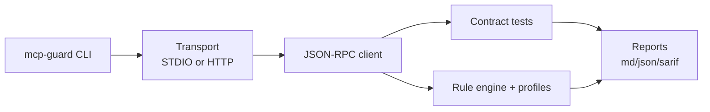
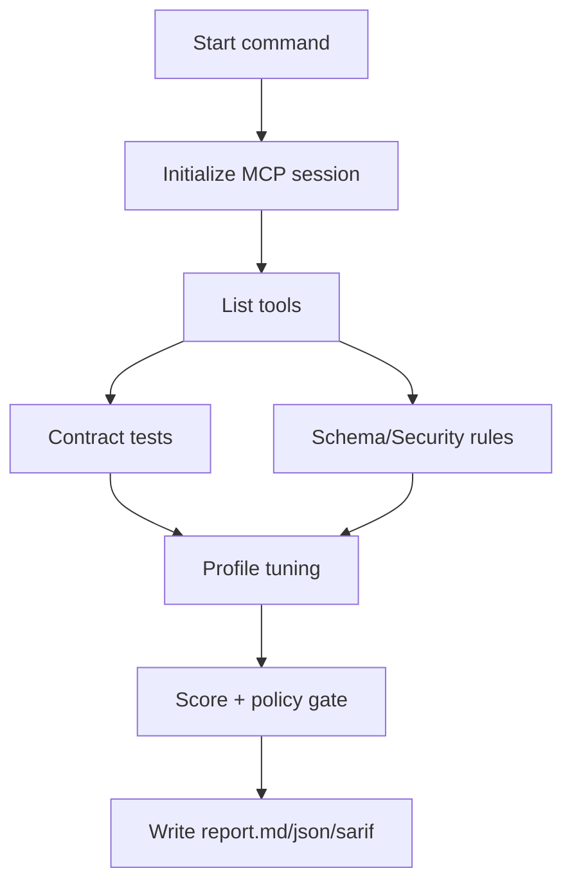

# mcp-guard

[](./.github/workflows/ci.yml)
[](https://www.npmjs.com/package/mcp-guard)
[](./LICENSE)
[](../../releases)

Validate, test, and audit MCP servers with deterministic contract checks and reproducible reports.

> Formerly **mcp-doctor**.

## Quickstart (20 seconds)

```bash
npm install
npm run build
npx mcp-guard audit --stdio "node fixtures/servers/hello-mcp-server/server.cjs" --out reports --sarif reports/report.sarif
```

Outputs:
- `reports/report.md`
- `reports/report.json`
- `reports/report.sarif`

## Demo


If you want a real terminal recording, replace `docs/assets/demo.gif` with an asciinema/GIF capture from your environment.

## What it does

- Connects to MCP servers over **STDIO** or **HTTP JSON-RPC**.
- Runs deterministic contract tests (`list`, `call`, error shape, cancellation behavior, large payload, timeout behavior).
- Applies schema + security lint rules and computes a risk score.
- Produces Markdown, JSON, and SARIF reports.
- Scans local MCP config files (Claude Desktop and Cursor patterns) with token redaction.

## Commands

```bash
# STDIO
mcp-guard validate --stdio "node server.cjs" --out reports
mcp-guard test --stdio "node server.cjs" --out reports
mcp-guard audit --stdio "node server.cjs" --profile strict --fail-on medium --sarif reports/report.sarif

# HTTP JSON-RPC
mcp-guard audit --http "http://127.0.0.1:4010" --timeout-ms 30000

# Config scan
mcp-guard scan --repo . --format md --out reports
mcp-guard scan --path ~/.config/Claude/claude_desktop_config.json --format json --out reports

# Registry
mcp-guard registry lint registry/servers.yaml
mcp-guard registry verify registry/servers.yaml --sample 5
mcp-guard registry score registry/servers.yaml
```

See full CLI docs in [`docs/cli.md`](docs/cli.md).

## Architecture



## Audit pipeline



## Why trust this tool?

- Deterministic contract tests only (no random probing).
- Timeouts on every request.
- Explicit policy gating (`--fail-on`).
- Reproducible outputs that are stable in CI.
- Offline registry verification mode.

## GitHub Action

```yaml
- uses: ./.github/actions/mcp-guard
  with:
    stdio_command: node fixtures/servers/hello-mcp-server/server.cjs
    fail_on: high
```

More examples: [`docs/github-action.md`](docs/github-action.md).

<details>
<summary><strong>CI / GitHub Action usage</strong></summary>

- Action inputs:
  - `stdio_command` (required)
  - `out_dir` (default `reports`)
  - `sarif_path` (default `reports/report.sarif`)
  - `fail_on` (`off|low|medium|high`, default `high`)
  - `timeout_ms` (default `30000`)
- SARIF is uploaded even if policy fails.

</details>

## Scanning local configs

`scan` currently detects:
- Claude Desktop-style config files
- Cursor MCP config files

Redaction promise:
- token-like values in command strings are masked (`<redacted>`)
- report output avoids printing obvious secret patterns

## Security model

Short version:
- bounded requests and retries
- deterministic tests only
- process cleanup on shutdown
- no remote execution during `registry verify`

Full details: [`docs/security-model.md`](docs/security-model.md).

## Rules and profiles

- Profiles: `default`, `strict`, `paranoid`
- Use `--profile` during `validate`/`audit`

Details: [`docs/rules.md`](docs/rules.md).

<details>
<summary><strong>How scoring works</strong></summary>

The score starts at 100 and subtracts penalties per finding.
Penalty weights depend on profile:

- `default`: low 5, medium 12, high 25
- `strict`: low 8, medium 15, high 28
- `paranoid`: low 10, medium 20, high 40

`report.md` includes an “Explain score” section with every applied penalty.

</details>

<details>
<summary><strong>Rule profiles</strong></summary>

- **default**: baseline checks
- **strict**: adds missing description + categorical enum hygiene checks
- **paranoid**: escalates shell/argv-related findings to high severity

</details>

## Output formats

- Markdown (`report.md`, `scan_report.md`)
- JSON (`report.json`, `scan_report.json`)
- SARIF (`report.sarif`)

## Contributing

- Add a rule: edit `src/security/rules/*` and document it in `docs/rules.md`.
- Add a contract test: extend `src/tests/contract/*` and `test/contract.spec.ts`.
- Add registry entries: update `registry/servers.yaml` and run `registry lint` + `registry verify`.

## FAQ

<details>
<summary>Does this execute arbitrary tools?</summary>
No. The contract suite is deterministic and bounded to known calls.
</details>

<details>
<summary>Does it support SSE transport?</summary>
Not yet. v0.3 in this repo adds HTTP JSON-RPC transport.
</details>

<details>
<summary>Can I use this in GitHub code scanning?</summary>
Yes. Use SARIF output directly or the composite action.
</details>

## License and security disclosure

MIT. See [`LICENSE`](LICENSE).

If you find a security issue in `mcp-guard`, please open a private security advisory or contact maintainers before public disclosure.
